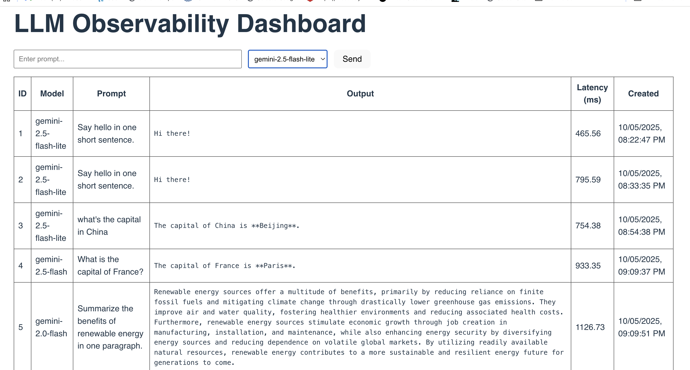
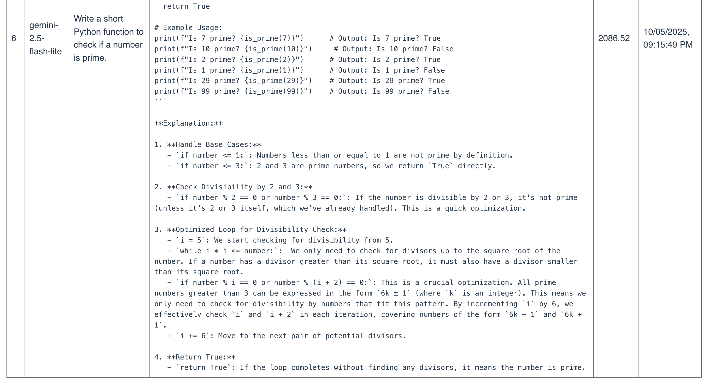

# LLM Observability Platform

This is a full-stack system to log and monitor LLM interactions(Job ID 7)

## Overview

The system records each LLM call including the model, prompt, output, latency, and timestamp. The backend connects to Google’s Gemini API, and the frontend displays the request history.

## Architecture

Backend: FastAPI (Python)  
Frontend: React (Vite)  
Database: SQLite  
Model API: Gemini

### Design

- Backend endpoints:
  - `POST /api/llm/invoke`: sends a prompt to Gemini, measures latency, logs the result.
  - `GET /api/requests`: returns all stored requests.
- Data fields: id, model, prompt, output, latency, created_at.
- The code structure supports extension to other providers by changing base URL, API key, and response mapping logic.

## Setup

Clone the repository:
```bash
git clone https://github.com/wenqian66/llm-observability-platform.git
cd llm-observability-platform
````

Create `backend/.env`:

```bash
GEMINI_API_KEY=your_api_key_here
DATABASE_URL=sqlite:///./app.db
ALLOWED_ORIGINS=http://localhost:5173
PROVIDER=gemini
MODEL=gemini-2.5-flash-lite
```

Run backend:

```bash
cd backend
source .venv/bin/activate
uvicorn app.main:app --reload --port 8000
```

Run frontend:

```bash
cd ../frontend
npm install
npm run dev
```

Then open [http://localhost:5173](http://localhost:5173)

## API

### POST /api/llm/invoke

Request:

```json
{
  "provider": "gemini",
  "model": "gemini-2.5-flash-lite",
  "prompt": "Say hello in one short sentence."
}
```

Response:

```json
{
  "id": 1,
  "prompt": "Say hello in one short sentence.",
  "output": "Hi there!",
  "latency_ms": 465.56,
  "created_at": "2025-10-05T08:22:47Z"
}
```

### GET /api/requests

Returns all stored logs.

## Example Prompts




## Notes

The application is configured for local use.
To switch providers, update the base URL, API key, and response logic in the backend.
SQLite can be replaced with PostgreSQL for larger scale use.


